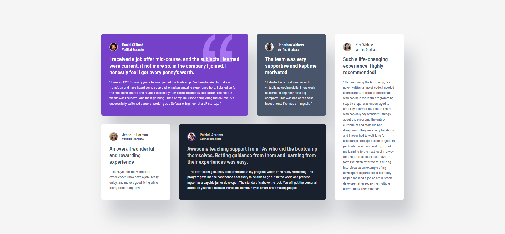

# Frontend Mentor - Testimonials grid section solution

This is a solution to the [Testimonials grid section challenge on Frontend Mentor](https://www.frontendmentor.io/challenges/testimonials-grid-section-Nnw6J7Un7). Frontend Mentor challenges help you improve your coding skills by building realistic projects. 

## Table of contents

- [Overview](#overview)
  - [The challenge](#the-challenge)
  - [Screenshot](#screenshot)
  - [Links](#links)
- [My process](#my-process)
  - [Built with](#built-with)
  - [What I learned](#what-i-learned)
  - [Continued development](#continued-development)
  - [Useful resources](#useful-resources)
- [Author](#author)

## Overview

### The challenge

Users should be able to:

- View the optimal layout for the site depending on their device's screen size

### Screenshot



### Links

- Solution URL: [Add solution URL here](https://github.com/lucarl07/testimonials-grid-section/)
- Live Site URL: [Add live site URL here](https://lucarl07.github.io/testimonials-grid-section/)

## My process

### Built with

- Semantic HTML5 markup
- CSS custom properties
- CSS Grid
- Mobile-first workflow (mostly)

### What I learned

While planning my approach with this challenge and deepening my knowledge on CSS Grid, I found about the `auto-fit` value as the first parameter to the `repeat()` function in `grid-template-columns`, which was exactly what I needed to craft easy responsiveness with little modifications being done inside media queries. The `grid-auto-rows` property was also very helpful, since the smaller the screen width, the more rows I'd have to deal with.

```css
.container {
  /* ... */
  grid-auto-rows: minmax(246px, auto);
  grid-template-columns: repeat(auto-fit, minmax(255px, 1fr));
}
```

### Continued development

I think I'm getting pretty good at this now. But I still got to practice more CSS, and I believe there are more advanced subjects I should tackle if I really want to be a professional front-end developer.

### Useful resources

- [Learn CSS Grid - A 13 Minute Deep Dive](https://www.youtube.com/watch?v=EiNiSFIPIQE) - This video from "Slaying the Dragon" made me fully grasp CSS Grid and the bits I've missed about it. It was watching this video that I learned about `repeat(auto-fit...)`.

## Author

- GitHub - [lucarl07](https://github.com/lucarl07)
- Frontend Mentor - [@lucarl07](https://www.frontendmentor.io/profile/lucarl07)
